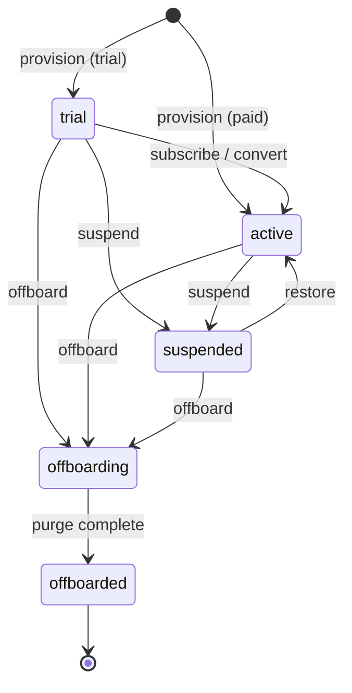

# Preckon Host — Backend Design Specification

**Control-plane backend: data model & API surface**

| | |
|---|---|
| **Audience** | Implementing backend engineer(s). Assumes familiarity with PostgreSQL, Better Auth, and REST/JSON APIs. |
| **Status** | Design-complete — all ten domains specified. No code yet; this is the contract to build against. |
| **Version** | 1.0 |
| **Date** | 2026-07-03 |
| **Scope** | The **Host** (platform-operator) control plane only — the console TechSME staff use to define the product, manage tenants, run billing, and operate the platform. The tenant application is a separate plane (see §0.2). |

## How to read this

Each domain section gives (a) the **data model** as PostgreSQL DDL with column-level notes, and (b) the **API surface** as an endpoint table with request/response shapes and side effects. §0 defines conventions that every section assumes — read it first. DDL uses forward references across sections (e.g. `audit_event` references `tenant`, defined in §3); resolve foreign keys against the full schema, not section-by-section.

The canonical entity–relationship map for the whole control plane was agreed separately and is the source of truth for which tables exist and how they relate; this document fills in the columns, constraints, and endpoints.

## Section index

| § | Domain | Status |
|---|---|---|
| 0 | Conventions & architecture | ✅ this installment |
| 1 | Host IAM (identity & access) | ✅ this installment |
| 2 | Audit (append-only, hash-chained) | ✅ this installment |
| 3 | Tenant management (lifecycle, impersonation, theming) | ✅ this installment |
| 4 | Product catalog (features, editions) | ✅ this installment |
| 5 | Entitlements (resolution & enforcement) | ✅ this installment |
| 6 | Pricing & packaging | ✅ this installment |
| 7 | Subscriptions & billing | ✅ this installment |
| 8 | Notifications | ✅ this installment |
| 9 | Platform settings (AI routing, email, security) | ✅ this installment |
| 10 | Observability | ✅ this installment |

---

# §0 — Conventions & architecture

## 0.1 Purpose

This spec defines the persistent data model and the HTTP API for the Host control plane. It is deliberately implementation-framework-agnostic at the API layer (any of Next.js route handlers, Nest, or FastAPI can serve it) but **PostgreSQL-specific at the data layer** — the schema, constraints, and audit guarantees are load-bearing and should be implemented as written.

## 0.2 The two-plane model (the single most important constraint)

Preckon runs two planes with **two separate identity pools**:

- **Control plane (this spec).** TechSME staff. All tables live in the PostgreSQL schema **`platform`**. These tables are **not** under tenant row-level security — they are platform-global. Host staff authenticate against a host-only Better Auth instance.
- **Tenant plane (separate spec).** Customer users and their construction data. Tables live under tenant RLS (`withTenant()` scoped repositories, `tenant_id` on every row, RLS policies). Host staff are **never** tenant users and never appear in tenant identity tables.

The control plane may read and act on tenant records, but only through **explicit, audited, scoped operations** (suspend, restore, impersonate, offboard). Every such cross-plane action:

1. takes an explicit `tenant_id` argument (never ambient),
2. writes an `audit_event` with `target_tenant_id` set (§2),
3. is gated by a specific RBAC permission (§1).

The tenant plane consumes exactly one thing from the control plane: **resolved entitlements** (read-only, §5). It never writes to `platform` tables.

## 0.3 Database conventions

**Engine.** PostgreSQL 16. Schema: `platform`. Required extensions: `citext` (case-insensitive email), `pgcrypto` (available for `gen_random_uuid()` fallback). `pg_uuidv7` is optional (see IDs below).

**Naming.** Tables are **singular** `snake_case` (`host_user`, not `host_users`). Columns are `snake_case`. Junction tables are `parent_child` (`host_role_permission`). Foreign keys are `<referenced_table>_id`; where a table references the same target twice, disambiguate with a role prefix (`actor_host_user_id`, `target_tenant_id`).

**Primary keys.** `id uuid primary key`. Values are **UUIDv7** (time-ordered, so PKs sort chronologically and index well) generated at the **application layer** — Drizzle supplies a `uuidv7()` default. DDL below shows `default gen_random_uuid()` purely as a database-side fallback so the schema is runnable standalone; the app overrides it with a v7 value on insert. If you prefer a DB-side default, install `pg_uuidv7` and swap the default to `uuid_generate_v7()`. **Do not expose sequential integers anywhere externally.**

**Timestamps.** `timestamptz` always, UTC. Every mutable table has `created_at timestamptz not null default now()` and `updated_at timestamptz not null default now()`. `updated_at` is maintained by a shared trigger:

```sql
create or replace function platform.set_updated_at() returns trigger as $$
begin
  new.updated_at := now();
  return new;
end;
$$ language plpgsql;
-- applied per table:
-- create trigger trg_set_updated_at before update on platform.<table>
--   for each row execute function platform.set_updated_at();
```

**Enumerations.** Status/kind fields are `text` with a `check` constraint (not PostgreSQL `enum` types) — adding a value is a cheap constraint change rather than an `ALTER TYPE` migration. Allowed values are documented on each column.

**Money.** All monetary amounts are stored as **integer minor units** (`bigint`, e.g. cents) plus a **currency code** (`char(3)`, ISO 4217, FK to `currency` in §6). This matches Stripe and avoids floating-point error. There is exactly one money convention across the whole schema — no `numeric`/`float` amounts, ever.

**Deletes.** Platform tables are **not hard-deleted**. Lifecycle is expressed with `status` columns. The only hard-delete path in the entire system is retention-gated tenant offboarding (§3), which is itself audited. `audit_event` is strictly append-only (§2).

**JSON.** Use `jsonb` for open-ended structured payloads (audit metadata, setting values). Never for anything that needs a foreign key or is queried relationally.

## 0.4 The canonical host use-case skeleton

Every mutating control-plane operation follows the same five steps. This is the same skeleton established in the Phase 0 Technical Implementation doc, adapted for the host plane (there is no tenant-scope step for platform-internal operations; cross-plane operations add an explicit target instead).

```
1. validate    — parse & validate input (schema); reject malformed early
2. authorize   — resolve host_user + role; assert required permission key
3. [target]    — for cross-plane ops only: load the target tenant explicitly
4. mutate      — perform the write inside a single DB transaction
5. audit       — append an audit_event describing what changed (§2)
   → return
```

Steps 4 and 5 are in the **same transaction** — the audit write and the mutation commit together or not at all. There is no code path that mutates control-plane state without an audit event.

## 0.5 API conventions

**Base path.** `/api/host/v1`. Versioned; breaking changes bump the version.

**Authentication.** Host session via **Better Auth** (host-only instance, §1). Every request resolves to a `host_user`, its role, and its permission set. Unauthenticated → `401`.

**Authorization.** Every endpoint declares a required **permission key** (§1.3). Missing permission → `403`. Authorization is checked server-side on every request; the console's UI gating is convenience only, never the boundary.

**Content type.** `application/json` for request and response bodies.

**Success envelope.** Resource endpoints return the resource (or `{ "data": [...], "next_cursor": "..." }` for lists) directly — no redundant wrapper.

**Error envelope.** Consistent shape on every non-2xx:

```json
{ "error": { "code": "forbidden", "message": "Missing permission: tenant.suspend", "details": {} } }
```

Status codes: `400` validation, `401` unauthenticated, `403` forbidden, `404` not found, `409` conflict (e.g. deleting a role with assigned users), `422` semantic/unprocessable, `429` rate-limited, `500` server error.

**Pagination.** List endpoints use **cursor** pagination: `?limit=<1..100, default 25>&cursor=<opaque>`. Cursors are opaque, keyed off the UUIDv7 PK ordering. Never offset pagination.

**Filtering/sorting.** Declared per endpoint. Filters are explicit query params; free-text search is `?q=`.

**Idempotency.** Mutating endpoints that create resources or trigger side effects (tenant provisioning §3, invoice actions §7) accept an `Idempotency-Key` header and de-duplicate on it for 24h.

**Correlation.** Every request carries/propagates `x-correlation-id` (generated if absent). It is stored on `audit_event.correlation_id` and forwarded to Langfuse/observability (§10).

---

# §1 — Host IAM

Identity and access for TechSME staff. **Authentication is delegated to Better Auth**; this domain owns the *authorization* model (roles, permissions) and the staff profile layered on top of Better Auth's identity.

## 1.1 Relationship to Better Auth

Better Auth (host-only instance) owns credentials, sessions, 2FA, and SSO, and manages its own tables in the `platform` schema (`user`, `session`, `account`, `verification`, …). We do **not** re-implement any of that.

- `host_user` is the **authoritative staff profile**, mapped 1:1 to a Better Auth user via `auth_user_id`. Role, status, and platform attributes live here.
- `host_session` in the ER map **is** Better Auth's `session` table — documented here for completeness, not redefined. Impersonation sessions are a *separate* concept and live in §3, not here.

## 1.2 Data model

```sql
-- Roles: system-provided + custom. One role per host_user.
create table platform.host_role (
  id          uuid primary key default gen_random_uuid(),
  key         text not null unique,            -- 'owner','admin','billing','support','read_only','custom_<slug>'
  name        text not null,                   -- display name
  description text,
  is_system   boolean not null default false,  -- system roles cannot be deleted or key-renamed
  created_at  timestamptz not null default now(),
  updated_at  timestamptz not null default now()
);

-- Permission catalog: static-ish, seeded (see §1.3). Grouped by category for the matrix UI.
create table platform.host_permission (
  id          uuid primary key default gen_random_uuid(),
  key         text not null unique,            -- e.g. 'tenant.suspend' (see §1.3)
  category    text not null,                   -- 'Tenants','Product','Pricing','Billing','Notifications','Administration','Operations'
  description text not null,
  created_at  timestamptz not null default now()
);

-- Which permissions a role grants (pure junction).
create table platform.host_role_permission (
  role_id       uuid not null references platform.host_role(id) on delete cascade,
  permission_id uuid not null references platform.host_permission(id) on delete cascade,
  primary key (role_id, permission_id)
);

-- Staff profile, 1:1 with a Better Auth user.
create table platform.host_user (
  id                  uuid primary key default gen_random_uuid(),
  auth_user_id        uuid not null unique,    -- FK to Better Auth user.id (same DB)
  email               citext not null unique,  -- denormalized for listing; Better Auth is source of truth
  display_name        text not null,
  role_id             uuid not null references platform.host_role(id),
  status              text not null default 'invited'
                        check (status in ('invited','active','suspended')),
  two_factor_enabled  boolean not null default false,  -- mirror of Better Auth state, for list display
  last_login_at       timestamptz,
  created_by          uuid references platform.host_user(id),  -- who invited this user (nullable, self-ref)
  created_at          timestamptz not null default now(),
  updated_at          timestamptz not null default now()
);

create index host_user_role_idx   on platform.host_user(role_id);
create index host_user_status_idx on platform.host_user(status);
```

**Design notes.**
- **One role per user.** Matches the console prototype and keeps permission resolution a single join. Custom roles are `host_role` rows with `is_system=false`; the RBAC matrix in the console edits `host_role_permission`.
- **Permission resolution:** `host_user → role_id → host_role_permission → permission keys`. Cache the resolved key set on the session; invalidate when a role's permissions change.
- **Suspending vs deleting staff:** no delete. `status='suspended'` blocks login (enforced at the Better Auth adapter). A user cannot suspend or demote **themselves** — enforce in the handler (`422`).
- `is_system` roles: their `key` and `is_system` flag are immutable; their permission set *may* be edited by an `owner`, but the console should warn.

## 1.3 Permission catalog (seed)

Seed `host_permission` with these keys. This is the authoritative catalog; endpoints in this spec reference these keys directly.

| Category | Key | Description |
|---|---|---|
| Tenants | `tenant.read` | View tenants and details |
| Tenants | `tenant.create` | Provision a new tenant |
| Tenants | `tenant.update` | Edit tenant metadata (name, contact, region) |
| Tenants | `tenant.suspend` | Suspend a tenant |
| Tenants | `tenant.restore` | Restore a suspended tenant |
| Tenants | `tenant.impersonate` | Start an audited impersonation session |
| Tenants | `tenant.offboard` | Offboard/export/delete a tenant (retention-gated) |
| Tenants | `tenant.theme.write` | Edit a tenant's white-label theme |
| Tenants | `entitlement.override` | Grant/revoke/limit a tenant's entitlements outside its edition |
| Product | `edition.read` | View editions |
| Product | `edition.write` | Create/edit editions |
| Product | `feature.read` | View feature catalog |
| Product | `feature.write` | Create/edit features |
| Pricing | `pricing.read` | View pricing |
| Pricing | `pricing.write` | Edit plan/usage pricing |
| Pricing | `coupon.write` | Create/manage coupons |
| Billing | `billing.read` | View subscriptions & invoices |
| Billing | `subscription.manage` | Create/change/cancel a tenant's subscription |
| Billing | `invoice.retry` | Retry a failed invoice charge |
| Billing | `invoice.remind` | Send an invoice reminder |
| Billing | `billing.refund` | Issue a refund |
| Notifications | `notification.read` | View notifications |
| Notifications | `notification.send` | Send broadcast notifications |
| Administration | `host_user.read` | View host staff |
| Administration | `host_user.manage` | Invite/edit/suspend host staff |
| Administration | `role.manage` | Create/edit roles & permissions |
| Operations | `audit.read` | Read the audit log |
| Operations | `audit.export` | Export the audit log |
| Operations | `settings.read` | View platform settings |
| Operations | `settings.write` | Edit general platform settings |
| Operations | `settings.ai.write` | Edit AI provider/routing config |
| Operations | `maintenance.toggle` | Toggle maintenance mode |
| Operations | `observability.read` | View queue/worker/AI health |
| Operations | `job.manage` | Retry or resolve failed background jobs |

Suggested system roles at seed time: `owner` (all keys), `admin` (all except `role.manage`, `billing.refund`, `maintenance.toggle`), `billing` (billing + pricing + `tenant.read`), `support` (`tenant.read`, `tenant.impersonate`, `notification.*`, `observability.read`, `audit.read`), `read_only` (all `*.read`).

## 1.4 API surface

All endpoints under `/api/host/v1`. Auth endpoints (login, logout, 2FA enroll/verify, SSO) are served by **Better Auth** at its own routes and are out of scope here.

### Session / current user

| Method | Path | Permission | Notes |
|---|---|---|---|
| `GET` | `/me` | *(authenticated)* | Returns the current staff profile, role, and resolved permission keys. The console calls this on load to gate UI. |

`GET /me` response:
```json
{
  "id": "01920e...",
  "email": "mahesh@techsme.com",
  "display_name": "Mahesh Mukkara",
  "role": { "key": "owner", "name": "Owner" },
  "permissions": ["tenant.read", "tenant.suspend", "edition.write", "..."],
  "two_factor_enabled": true
}
```

### Host users

| Method | Path | Permission | Side effects |
|---|---|---|---|
| `GET` | `/host-users` | `host_user.read` | List. Filters: `?status=`, `?role_id=`, `?q=`. Cursor-paginated. |
| `POST` | `/host-users` | `host_user.manage` | Invite. Creates a Better Auth user (invite flow) + `host_user` (`status='invited'`), sends invite email. Audited. |
| `GET` | `/host-users/{id}` | `host_user.read` | Detail. |
| `PATCH` | `/host-users/{id}` | `host_user.manage` | Update `display_name`, `role_id`, `status`. Cannot suspend/demote self (`422`). Audited. |
| `POST` | `/host-users/{id}/resend-invite` | `host_user.manage` | Re-sends the invite email. Audited. |

`POST /host-users` request:
```json
{ "email": "new.staff@techsme.com", "display_name": "New Staff", "role_id": "0191..." }
```

### Roles & permissions

| Method | Path | Permission | Side effects |
|---|---|---|---|
| `GET` | `/roles` | `host_user.read` | List roles with their permission keys and assigned-user counts. |
| `POST` | `/roles` | `role.manage` | Create a custom role (`is_system=false`) with a permission set. Audited. |
| `GET` | `/roles/{id}` | `host_user.read` | Detail incl. permission keys. |
| `PATCH` | `/roles/{id}` | `role.manage` | Rename/describe; replace permission set. System role `key`/`is_system` immutable (`422`). Audited. |
| `DELETE` | `/roles/{id}` | `role.manage` | Delete a custom role. `409` if any user is assigned, or if `is_system`. Audited. |
| `GET` | `/permissions` | `role.manage` | The full permission catalog, grouped by category (drives the RBAC matrix UI). |

`POST /roles` request:
```json
{ "name": "Onboarding specialist", "description": "Provisions and configures new tenants",
  "permission_keys": ["tenant.read", "tenant.create", "tenant.theme.write", "edition.read"] }
```

---

# §2 — Audit

An **append-only, tamper-evident** record of every control-plane action. This is the compliance and forensics backbone; the guarantees below are non-negotiable.

## 2.1 Data model

```sql
-- Global sequence backing the hash chain ordering.
create sequence platform.audit_event_seq;

create table platform.audit_event (
  id                  uuid primary key default gen_random_uuid(),
  seq                 bigint not null default nextval('platform.audit_event_seq') unique,
  occurred_at         timestamptz not null default now(),

  actor_host_user_id  uuid references platform.host_user(id),   -- null for system-originated events
  actor_type          text not null default 'host_user'
                        check (actor_type in ('host_user','system','impersonated')),

  action              text not null,                            -- 'tenant.suspend','edition.update','host_user.invite', ...
  target_type         text,                                     -- 'tenant','edition','host_user','invoice','role', ...
  target_id           uuid,                                     -- id of the affected resource
  target_tenant_id    uuid references platform.tenant(id),      -- set for tenant-directed actions; null otherwise (§0.2)

  summary             text not null,                            -- human-readable one-liner
  metadata            jsonb not null default '{}',              -- before/after diff, request context
  correlation_id      uuid,                                     -- ties to observability (§10)
  ip                  inet,
  user_agent          text,

  prev_hash           bytea,                                    -- hash of the previous event (null for the genesis row)
  hash                bytea not null                            -- sha256 over canonical(fields || prev_hash)
);

create index audit_event_actor_idx   on platform.audit_event(actor_host_user_id);
create index audit_event_target_idx  on platform.audit_event(target_type, target_id);
create index audit_event_tenant_idx  on platform.audit_event(target_tenant_id);
create index audit_event_time_idx    on platform.audit_event(occurred_at);
create index audit_event_action_idx  on platform.audit_event(action);
```

There is **no** `updated_at` and **no** soft-delete column — rows are immutable and permanent.

## 2.2 Tamper-evidence (hash chain)

Each event stores `prev_hash` (the previous event's `hash`) and its own `hash`, computed as `sha256` over a canonical serialization of the event's fields concatenated with `prev_hash`. Any insertion, mutation, or deletion in the middle of the chain breaks every subsequent `hash`, making tampering detectable.

**Writing an event** is done only through a single DB function, never by direct `INSERT` from application code:

```sql
create or replace function platform.append_audit_event(
  p_actor_host_user_id uuid, p_actor_type text, p_action text,
  p_target_type text, p_target_id uuid, p_target_tenant_id uuid,
  p_summary text, p_metadata jsonb, p_correlation_id uuid, p_ip inet, p_user_agent text
) returns platform.audit_event as $$
declare
  v_prev   platform.audit_event;
  v_row    platform.audit_event;
  v_canon  text;
begin
  -- Serialize the chain: lock the tail so concurrent writers append in a defined order.
  perform pg_advisory_xact_lock(hashtext('platform.audit_event'));
  select * into v_prev from platform.audit_event order by seq desc limit 1;

  insert into platform.audit_event (
    actor_host_user_id, actor_type, action, target_type, target_id, target_tenant_id,
    summary, metadata, correlation_id, ip, user_agent, prev_hash, hash
  ) values (
    p_actor_host_user_id, p_actor_type, p_action, p_target_type, p_target_id, p_target_tenant_id,
    p_summary, coalesce(p_metadata,'{}'::jsonb), p_correlation_id, p_ip, p_user_agent,
    v_prev.hash, '\x00'::bytea   -- placeholder, recomputed below
  ) returning * into v_row;

  v_canon := v_row.seq || '|' || extract(epoch from v_row.occurred_at) || '|' ||
             coalesce(v_row.actor_host_user_id::text,'') || '|' || v_row.action || '|' ||
             coalesce(v_row.target_type,'') || '|' || coalesce(v_row.target_id::text,'') || '|' ||
             coalesce(v_row.target_tenant_id::text,'') || '|' || v_row.metadata::text || '|' ||
             coalesce(encode(v_row.prev_hash,'hex'),'');

  update platform.audit_event set hash = digest(v_canon, 'sha256') where id = v_row.id
    returning * into v_row;
  return v_row;
end;
$$ language plpgsql;
```

> Host-plane actions are **low volume** (admin operations, not per-request traffic), so a globally serialized chain via the advisory lock is acceptable and simplest. If write volume ever demands it, partition the chain per-day or per-actor and verify per-partition — but do not do this pre-emptively.

**Append-only enforcement** (defense in depth beyond "only call the function"):

```sql
-- 1) Revoke mutation privileges from the application role.
revoke update, delete, truncate on platform.audit_event from <app_role>;

-- 2) Belt-and-braces trigger that hard-rejects updates/deletes even from a privileged role.
create or replace function platform.audit_event_immutable() returns trigger as $$
begin
  raise exception 'audit_event is append-only (attempted %)', tg_op;
end;
$$ language plpgsql;
create trigger trg_audit_event_immutable
  before update or delete on platform.audit_event
  for each row execute function platform.audit_event_immutable();
```

The `hash` self-update inside `append_audit_event` happens **before** the immutability trigger is a concern only if the trigger is `BEFORE UPDATE` — to avoid a conflict, compute the hash in the same `INSERT` via a `BEFORE INSERT` trigger instead of a post-insert `UPDATE`. (Implementer's choice; the cleaner form is a single `BEFORE INSERT` trigger that sets `prev_hash` and `hash`. The function above is shown for readability. Pick one path and keep the immutability trigger `UPDATE OR DELETE` only.)

## 2.3 Verification job

A scheduled job (and an on-demand endpoint) re-walks the chain in `seq` order, recomputes each `hash` from stored fields + `prev_hash`, and asserts it matches. On mismatch it reports the first broken `seq` and alerts. This is what makes the tamper-evidence *operational* rather than theoretical.

## 2.4 API surface

Audit events are **written only as a side effect** of the use-case skeleton (§0.4) — there is deliberately **no** create endpoint. The API is read/verify/export only.

| Method | Path | Permission | Notes |
|---|---|---|---|
| `GET` | `/audit-events` | `audit.read` | List, reverse-chronological. Filters: `?actor_host_user_id=`, `?action=`, `?target_type=`, `?target_id=`, `?target_tenant_id=`, `?from=`, `?to=`, `?category=`. Cursor-paginated. |
| `GET` | `/audit-events/{id}` | `audit.read` | Single event incl. `metadata`, `hash`, `prev_hash`. |
| `POST` | `/audit-events/export` | `audit.export` | Kicks off an async export (CSV/JSON) for a filter range; returns `{ "job_id": "..." }`. Poll via the jobs endpoint (§10) for a signed download URL. Audited (yes — exporting the audit log is itself an audited action). |
| `GET` | `/audit-events/verify` | `audit.read` | Runs chain verification over an optional `?from=&to=` range. Returns `{ "ok": true }` or `{ "ok": false, "first_broken_seq": 4213 }`. |

---

# §3 — Tenant management

The control plane's view of each customer organization, its lifecycle, the audited ways host staff act on it, and its white-label theme. This is where the two-plane boundary (§0.2) is exercised in practice — every operation here that touches customer data is explicit, permissioned, and audited.

## 3.1 The tenant record

```sql
create table platform.tenant (
  id                    uuid primary key default gen_random_uuid(),
  slug                  text not null unique,        -- URL-safe org key; used by tenant-plane routing
  name                  text not null,               -- display name, e.g. 'Cedar & Stone Builders'
  legal_name            text,
  status                text not null default 'trial'
                          check (status in ('trial','active','suspended','offboarding','offboarded')),
  region                text not null,               -- data-residency region, e.g. 'ca-central'
  current_edition_id    uuid not null references platform.edition(id),  -- ENTITLEMENT anchor (see 3.1.1)
  trial_ends_at         timestamptz,                 -- set while status = 'trial'
  primary_contact_email citext not null,             -- host<->tenant comms; the real admin lives in the tenant plane
  provisioned_by        uuid references platform.host_user(id),
  suspended_at          timestamptz,
  suspended_reason      text,
  offboarded_at         timestamptz,
  entitlement_version   bigint not null default 0,   -- bumped on any entitlement-affecting change (§5.4)
  created_at            timestamptz not null default now(),
  updated_at            timestamptz not null default now()
);
create index tenant_status_idx  on platform.tenant(status);
create index tenant_edition_idx on platform.tenant(current_edition_id);
create index tenant_region_idx  on platform.tenant(region);
```

### 3.1.1 Edition anchor vs. subscription (important separation)

`tenant.current_edition_id` is the **entitlement anchor** — the single source of truth for *what the tenant can do* (§5 resolves entitlements from it). The `subscription` (§7) is the **billing arrangement** — the source of truth for *what the tenant pays and its billing state*.

These are deliberately decoupled: a tenant that is past-due but not yet suspended still has full entitlements per its edition. The billing domain updates `current_edition_id` **in the same transaction** as a plan change, so the anchor never drifts from the paid plan — but entitlement resolution never reads billing status. Suspension (a lifecycle state, 3.2) is the mechanism that actually cuts off access, not billing status.

`seats` are **not** stored on `tenant`: the seat *cap* is a limit-type entitlement (§5), and seat *usage* is a tenant-plane fact read via a rollup (surfaced on the detail endpoint, 3.5).

## 3.2 Lifecycle state machine

Status transitions are constrained — the handler rejects any transition not in this set (`422`). `offboarded` is terminal.



| From | To | Trigger | Permission |
|---|---|---|---|
| — | `trial` / `active` | `POST /tenants` (provision) | `tenant.create` |
| `trial` | `active` | tenant subscribes (billing, §7) | *(system)* |
| `trial` / `active` | `suspended` | `POST /tenants/{id}/suspend` | `tenant.suspend` |
| `suspended` | `active` | `POST /tenants/{id}/restore` | `tenant.restore` |
| `trial` / `active` / `suspended` | `offboarding` | `POST /tenants/{id}/offboard` | `tenant.offboard` |
| `offboarding` | `offboarded` | purge job completes | *(system)* |

**Suspension** flips the tenant-plane login gate: suspended tenants' users cannot authenticate. It is reversible (`restore`).

**Offboarding** is a two-step, retention-gated process (3.4). It is the only path that destroys customer data.

## 3.3 Impersonation

When a host user with `tenant.impersonate` needs to see the product as a tenant does (support/debugging), they open a **time-boxed, audited** impersonation session.

```sql
create table platform.impersonation_session (
  id            uuid primary key default gen_random_uuid(),
  tenant_id     uuid not null references platform.tenant(id),
  host_user_id  uuid not null references platform.host_user(id),
  reason        text not null,                  -- required justification, captured for audit
  status        text not null default 'active'
                  check (status in ('active','ended','expired')),
  started_at    timestamptz not null default now(),
  expires_at    timestamptz not null,           -- hard time-box (default from settings, e.g. now()+30min)
  ended_at      timestamptz,
  ip            inet,
  user_agent    text
);

-- At most one active impersonation per host user, enforced at the DB layer:
create unique index impersonation_one_active_per_host_user
  on platform.impersonation_session(host_user_id) where status = 'active';
create index impersonation_tenant_idx on platform.impersonation_session(tenant_id);
```

**How it works across planes.** Starting a session mints a **short-lived, tenant-scoped token** that the tenant app accepts, tagged `impersonated`. The tenant app must show a persistent impersonation banner while it is active. Actions taken during impersonation are logged in **both** planes: the host `audit_event` records session start and end; the tenant-plane audit records each action with `actor_type = 'impersonated'` and the originating `host_user_id`.

**Guardrails** (enforce in the handler / token policy):
- `expires_at` is a hard limit; the token and the session both expire at it. A background sweep flips lapsed sessions to `status = 'expired'`.
- **Read-only by default.** Write actions during impersonation are disallowed in v1. A future elevated "write impersonation" flag is out of scope and must be its own permission + heavier audit — do not add it implicitly.
- One active session per host user (the partial unique index above).
- `reason` is mandatory and stored on both the session and the audit event.

## 3.4 Offboarding & retention

Offboarding is deliberately slow and reversible-until-purge:

1. `POST /tenants/{id}/offboard` requires the caller to echo the tenant `slug` in the body as a confirmation guard, and requires `tenant.offboard`. Status → `offboarding`. Audited.
2. A **full data export** job is kicked off and made available (signed download) so the customer can retrieve their data.
3. A **retention window** (configurable in settings, default 30 days) elapses. During the window the tenant is inaccessible but recoverable by support.
4. After the window, the **purge job** hard-deletes all **tenant-plane** data (construction records, storage objects, embeddings) and scrubs PII on the platform row (`primary_contact_email`, `legal_name` nulled; logo removed). The platform `tenant` row is **retained as a tombstone** (`id`, `slug`, `name`, `status = 'offboarded'`, timestamps) so that `audit_event.target_tenant_id` foreign keys stay valid and the `slug` cannot be silently reused. Status → `offboarded`.

So the "hard delete" of §0.3 is scoped to *tenant-plane customer data*, not the platform tombstone.

## 3.5 White-label theme

Per-tenant branding, stored in the control plane and served to the tenant app via CSS-variable injection. Editable from **both** planes — by host staff (this API, `tenant.theme.write`) and by tenant admins via the tenant-plane self-service branding screen — writing to the same table with identical server-side validation.

```sql
create table platform.tenant_theme (
  tenant_id        uuid primary key references platform.tenant(id) on delete cascade,
  logo_object_key  text,                       -- object-storage key at a tenant-scoped path; NEVER a raw URL
  brand_color      text check (brand_color      ~ '^#[0-9a-fA-F]{6}$'),  -- validated hex only
  brand_color_dark text check (brand_color_dark ~ '^#[0-9a-fA-F]{6}$'),
  accent_color     text check (accent_color     ~ '^#[0-9a-fA-F]{6}$'),
  theme_tokens     jsonb not null default '{}', -- allow-listed keys/values only (see below)
  updated_by       uuid references platform.host_user(id),
  updated_at       timestamptz not null default now()
);
```

**Injection-vector protection (mandatory).** Nothing here is ever emitted verbatim into CSS. The DB `check` constraints enforce that color columns are strictly `#RRGGBB`. `theme_tokens` is validated server-side against a **fixed allow-list** of token keys, each with an allowed value format (color hex, enumerated font-family name, bounded numeric); unknown keys or malformed values are rejected. The tenant app injects only these validated tokens as CSS custom properties. This is the same allow-list discipline specified in the Technical Implementation doc (§11.1).

**Logo upload** follows the canonical use-case skeleton (§0.4): validate content-type (`image/png`, `image/svg+xml`, `image/jpeg`) and size (cap, e.g. 512 KB), store at a tenant-scoped object path, record the object key, audit. The stored value is an object key, not a URL; the tenant app resolves it to a signed/CDN URL at serve time.

## 3.6 API surface

All under `/api/host/v1`.

### Tenant records & lifecycle

| Method | Path | Permission | Side effects |
|---|---|---|---|
| `GET` | `/tenants` | `tenant.read` | List. Filters: `?status=`, `?region=`, `?edition_id=`, `?q=` (name/slug/contact). Cursor-paginated. Each row includes status, edition, region, `seats_in_use` (rollup). |
| `POST` | `/tenants` | `tenant.create` | **Provision.** `Idempotency-Key` required. Creates the platform `tenant` row, invokes tenant-plane bootstrap (schema/RLS init, storage path, first-admin invite), and — if paid — creates a subscription (§7). All in one orchestration; partial failure rolls back. Audited. |
| `GET` | `/tenants/{id}` | `tenant.read` | Detail: full record, current edition, subscription summary (§7), theme (§3.5), `seats_in_use`, and recent audit events for this tenant. |
| `PATCH` | `/tenants/{id}` | `tenant.update` | Edit `name`, `legal_name`, `primary_contact_email`, `region`. Audited. |
| `POST` | `/tenants/{id}/suspend` | `tenant.suspend` | Body: `{ "reason": "..." }` (required). `trial`/`active` → `suspended`; sets `suspended_at`/`suspended_reason`; blocks tenant-plane login. Audited (`target_tenant_id`). |
| `POST` | `/tenants/{id}/restore` | `tenant.restore` | `suspended` → `active` (or back to `trial` if `trial_ends_at` is future). Clears suspension. Audited. |
| `POST` | `/tenants/{id}/offboard` | `tenant.offboard` | Body: `{ "confirm_slug": "<slug>" }` (must match). Starts offboarding (3.4): status → `offboarding`, kicks export + schedules purge. Audited. |
| `GET` | `/tenants/{id}/export` | `tenant.offboard` | Kicks off / returns a full tenant data export job → signed download. Audited. |

`POST /tenants` request:
```json
{
  "name": "Cedar & Stone Builders",
  "slug": "cedar-stone",
  "region": "ca-central",
  "edition_id": "0191...",
  "primary_contact_email": "admin@cedarstone.example",
  "start_as": "trial"            // or "active"
}
```

### Impersonation

| Method | Path | Permission | Side effects |
|---|---|---|---|
| `POST` | `/tenants/{id}/impersonate` | `tenant.impersonate` | Body: `{ "reason": "..." }` (required). Creates an `impersonation_session` (time-boxed), returns a scoped impersonation URL/token into the tenant app. Rejected (`409`) if the host user already has an active session. Audited (start). |
| `POST` | `/tenants/{id}/impersonate/{session_id}/end` | `tenant.impersonate` | Ends the session (`status = 'ended'`, `ended_at`). Audited (end). |
| `GET` | `/tenants/{id}/impersonation-sessions` | `tenant.read` | History of impersonation sessions for the tenant (who, when, why, duration). |

### Theme

| Method | Path | Permission | Side effects |
|---|---|---|---|
| `GET` | `/tenants/{id}/theme` | `tenant.read` | Current theme. |
| `PUT` | `/tenants/{id}/theme` | `tenant.theme.write` | Set colors (validated hex) + allow-listed `theme_tokens`. Rejects malformed values (`422`). Audited. |
| `POST` | `/tenants/{id}/theme/logo` | `tenant.theme.write` | Upload logo (validated type/size, tenant-scoped storage). Returns object key. Audited. |
| `DELETE` | `/tenants/{id}/theme/logo` | `tenant.theme.write` | Remove logo. Audited. |

---

# §4 — Product catalog

Where TechSME defines the product: the **feature registry**, the **editions** (plans), and the **edition ↔ feature** matrix that says what each plan includes. Everything downstream draws from here — entitlements (§5) resolve against it, pricing (§6) attaches money to it, billing (§7) meters it.

## 4.1 The feature registry (the unified anchor)

There is **one** `feature` table, not three. A feature's `type` tells every consumer how to treat it:

- **`flag`** — a boolean capability. Modules (the seven Logix modules + Copilot) and capabilities (SSO, white-label). Per edition: included or not.
- **`limit`** — a bounded allowance per edition. Numeric caps (seats, projects, storage) or enumerated tiers (audit export: basic/full). Enforced at read time by entitlements (§5).
- **`metric`** — a metered, billable counter (drawings, BOQs, estimates, packages, Copilot usage). Per edition: an included quota; beyond it, `usage_rate` (§6) prices each unit and `usage_record` (§7) counts consumption.

This is the decision made in the ER map: `usage_rate` and `usage_record` point at the same registry the edition matrix does. One catalog to manage, one place to add a module.

```sql
create table platform.feature (
  id             uuid primary key default gen_random_uuid(),
  key            text not null unique,        -- 'module.schedulelogix','limit.seats','metric.drawings'
  name           text not null,
  description    text,
  category       text not null                -- UI grouping in the console
                   check (category in ('module','capability','limit','usage')),
  type           text not null                -- drives resolution & billing
                   check (type in ('flag','limit','metric')),
  value_type     text not null                -- shape of the per-edition value
                   check (value_type in ('boolean','numeric','enum')),
  unit           text,                        -- 'seat','project','GB','drawing','boq' (limit/metric)
  allowed_values text[],                      -- required when value_type='enum' (e.g. {'basic','full'})
  status         text not null default 'active'
                   check (status in ('active','deprecated')),
  sort_order     int not null default 0,      -- stable ordering in the matrix (module chain order)
  created_at     timestamptz not null default now(),
  updated_at     timestamptz not null default now(),
  check ((type = 'flag'   and value_type = 'boolean')
      or (type = 'metric' and value_type = 'numeric')
      or (type = 'limit'  and value_type in ('numeric','enum'))),
  check (value_type <> 'enum' or allowed_values is not null)
);
create index feature_category_idx on platform.feature(category);
create index feature_type_idx     on platform.feature(type);
create index feature_status_idx   on platform.feature(status);
```

The two `check` constraints encode the type↔value_type consistency inside the row. Cross-table rules (enum membership) are enforced in the app layer (4.3).

### 4.1.1 Seed catalog

Seed the registry with these. Module `sort_order` follows the canonical chain (TenderLogix → … → ScheduleLogix → ProcureLogix → Copilot).

| key | name | category | type | value_type | unit |
|---|---|---|---|---|---|
| `module.tenderlogix` | TenderLogix | module | flag | boolean | — |
| `module.drawlogix` | DrawLogix | module | flag | boolean | — |
| `module.doclogix` | DocLogix | module | flag | boolean | — |
| `module.quantlogix` | QuantLogix | module | flag | boolean | — |
| `module.costlogix` | CostLogix | module | flag | boolean | — |
| `module.schedulelogix` | ScheduleLogix | module | flag | boolean | — |
| `module.procurelogix` | ProcureLogix | module | flag | boolean | — |
| `module.copilot` | Construction Copilot | module | flag | boolean | — |
| `capability.white_label` | White-labeling | capability | flag | boolean | — |
| `capability.sso` | SSO | capability | flag | boolean | — |
| `capability.api_access` | API access | capability | flag | boolean | — |
| `capability.industry_benchmarks` | Industry benchmarks (opt-in) | capability | flag | boolean | — |
| `limit.seats` | Seats | limit | limit | numeric | seat |
| `limit.projects` | Active projects | limit | limit | numeric | project |
| `limit.storage_gb` | Storage | limit | limit | numeric | GB |
| `limit.audit_export` | Audit export | limit | limit | enum | — |
| `metric.drawings` | Drawings processed | usage | metric | numeric | drawing |
| `metric.boqs` | BOQs generated | usage | metric | numeric | boq |
| `metric.estimates` | Estimates produced | usage | metric | numeric | estimate |
| `metric.procurement_packages` | Procurement packages | usage | metric | numeric | package |
| `metric.copilot_tokens` | Copilot usage | usage | metric | numeric | token |

`limit.audit_export` seeds `allowed_values = {'basic','full'}`.

## 4.2 Editions

Editions are the plans (Starter / Professional / Enterprise, plus any custom). **Pricing is not here** — it lives in §6, one price row per edition per currency. An edition is the *shape* of a plan; the price is a separate concern.

```sql
create table platform.edition (
  id          uuid primary key default gen_random_uuid(),
  key         text not null unique,           -- 'starter','professional','enterprise'
  name        text not null,
  description text,
  status      text not null default 'draft'
                check (status in ('draft','published','archived')),
  is_public   boolean not null default true,  -- self-serve visible vs. custom/negotiated (Enterprise often false)
  trial_days  int not null default 0,         -- default trial length for tenants provisioned on this edition
  sort_order  int not null default 0,
  created_at  timestamptz not null default now(),
  updated_at  timestamptz not null default now()
);
create index edition_status_idx on platform.edition(status);
```

**Publish semantics.** `draft → published → archived`. Only `published` editions may have tenants/subscriptions. `archived` editions keep existing tenants but aren't offered to new ones.

**Live-effect warning (design decision for v1).** Entitlements are computed live from `edition_feature` (§5) — so editing a **published** edition's features changes what *every current tenant on that edition* can do, immediately. v1 permits this (audited, with a console warning). Edition **versioning** (freeze a plan, migrate tenants deliberately) is a known future need but is **not** built in v1 — do not add it implicitly. Flagged here so it's a conscious choice, not a surprise.

## 4.3 The matrix cell: `edition_feature`

The junction carries payload — this is where "Starter gives 3 seats, Pro gives 25, Enterprise unlimited" is stored.

```sql
create table platform.edition_feature (
  edition_id  uuid not null references platform.edition(id) on delete cascade,
  feature_id  uuid not null references platform.feature(id),
  enabled     boolean not null default false, -- is this feature included in this edition?
  limit_value numeric,                         -- numeric cap (limit) or included quota (metric)
  enum_value  text,                            -- enum-valued limits; must be in feature.allowed_values
  primary key (edition_id, feature_id),
  check (limit_value is null or limit_value >= 0)
);
create index edition_feature_feature_idx on platform.edition_feature(feature_id);
```

**Value semantics** — how the columns combine, by feature type:

| `feature.type` | `enabled = false` | `enabled = true` |
|---|---|---|
| `flag` | not included | included |
| `limit` (numeric) | not available | cap = `limit_value`; `null` ⇒ **unlimited** |
| `limit` (enum) | not available | tier = `enum_value` (∈ `allowed_values`) |
| `metric` | not available | included quota = `limit_value` (`0` = none free, all metered); per-unit price in §6 |

**App-layer validation** (PostgreSQL `check` can't reference another table, so the use-case layer enforces): for each row, the correct value column is populated for the feature's `type`/`value_type`; `enum_value ∈ feature.allowed_values`; unused value columns are `null`. Reject violations `422`.

## 4.4 API surface

All under `/api/host/v1`.

### Features

| Method | Path | Permission | Side effects |
|---|---|---|---|
| `GET` | `/features` | `feature.read` | Catalog. Filters: `?category=`, `?type=`, `?status=`, `?q=`. Each includes an edition-membership summary (which editions include it) for the pills. |
| `POST` | `/features` | `feature.write` | Create a feature. Audited. |
| `GET` | `/features/{id}` | `feature.read` | Detail incl. per-edition values. |
| `PATCH` | `/features/{id}` | `feature.write` | Edit `name`, `description`, `category`, `unit`, `allowed_values`, `status`, `sort_order`. `key` and `type` are **immutable once referenced** by any edition or usage rate (`409`). Audited. |

No delete — retire via `status = 'deprecated'`.

`POST /features` request:
```json
{ "key": "capability.api_access", "name": "API access", "category": "capability",
  "type": "flag", "value_type": "boolean", "sort_order": 20 }
```

### Editions

| Method | Path | Permission | Side effects |
|---|---|---|---|
| `GET` | `/editions` | `edition.read` | Plan-card list: status, module/feature counts, `is_public`, `trial_days`. |
| `POST` | `/editions` | `edition.write` | Create edition (`status='draft'`). Audited. |
| `GET` | `/editions/{id}` | `edition.read` | Detail incl. the full `edition_feature` set. |
| `PATCH` | `/editions/{id}` | `edition.write` | Edit metadata + `status` (publish/archive transitions validated). Audited. |
| `PUT` | `/editions/{id}/features` | `edition.write` | **Set the edition's feature config** — the editor's toggle-checklist + limit/quota values, as a bulk upsert of `edition_feature` rows. Validated per 4.3. Warns if the edition is `published` (live effect). Audited. |
| `GET` | `/editions/matrix` | `edition.read` | The full feature × published-edition matrix in one call — powers the comparison grid. |

`PUT /editions/{id}/features` request:
```json
{ "features": [
  { "feature_key": "module.schedulelogix", "enabled": true },
  { "feature_key": "limit.seats", "enabled": true, "limit_value": 25 },
  { "feature_key": "limit.audit_export", "enabled": true, "enum_value": "full" },
  { "feature_key": "metric.drawings", "enabled": true, "limit_value": 50 }
] }
```

`GET /editions/matrix` response shape:
```json
{
  "editions": [ { "id": "0191...", "key": "starter", "name": "Starter" }, "..." ],
  "groups": [
    { "category": "module", "features": [
      { "key": "module.tenderlogix", "name": "TenderLogix", "type": "flag",
        "cells": { "0191...": { "enabled": true }, "0192...": { "enabled": true } } }
    ]},
    { "category": "limit", "features": [
      { "key": "limit.seats", "name": "Seats", "type": "limit",
        "cells": { "0191...": { "enabled": true, "limit_value": 3 },
                   "0192...": { "enabled": true, "limit_value": 25 } } }
    ]}
  ]
}
```

---

# §5 — Entitlements

The bridge. Entitlements answer one question for the tenant plane: **"what can this tenant do, right now?"** They are **computed, not stored** — the effective set is `edition_feature` (for the tenant's current edition) overlaid with any `tenant_entitlement_override`. There is no `effective_entitlement` table to keep in sync; there is a resolution query and a cache.

## 5.1 `tenant_entitlement_override`

Per-tenant deviations from the edition, for the cases the catalog can't express: grant a tenant SSO as a one-off, bump one tenant's seat cap without changing their plan, or revoke a module during a dispute. Each row is a **sparse patch** over the edition — only the fields it sets are overridden; the rest inherit.

```sql
create table platform.tenant_entitlement_override (
  tenant_id                uuid not null references platform.tenant(id) on delete cascade,
  feature_id               uuid not null references platform.feature(id),
  enabled_override         boolean,          -- null = inherit; true = force include; false = force exclude
  limit_value_override     numeric,          -- non-null = set this numeric cap / quota
  limit_unlimited_override boolean not null default false,  -- true = override to unlimited (resolves the null ambiguity)
  enum_value_override      text,             -- non-null = set this tier (must be in feature.allowed_values)
  reason                   text not null,    -- why this override exists (ops clarity + audit)
  expires_at               timestamptz,      -- null = permanent; once past, the override is ignored and swept
  created_by               uuid references platform.host_user(id),
  created_at               timestamptz not null default now(),
  updated_at               timestamptz not null default now(),
  primary key (tenant_id, feature_id),
  check (limit_value_override is null or limit_value_override >= 0),
  check (not (limit_unlimited_override and limit_value_override is not null))
);
create index tenant_override_feature_idx on platform.tenant_entitlement_override(feature_id);
```

`limit_unlimited_override` exists because `null` on a numeric limit already means "unlimited" in `edition_feature` (§4.3) — so on the override side, `null` has to mean "inherit," and unlimited needs its own explicit flag. The `check` forbids setting both unlimited and a numeric value.

`expires_at` makes temporary grants first-class (a 30-day seat bump, a trial of a paid module). Expired overrides are ignored by resolution and removed by a periodic sweep.

## 5.2 Resolution algorithm

For each active feature, resolve inclusion, then value:

```
included := override.enabled_override        if set, else edition_feature.enabled, else false

value    := (limit / metric):
              null (unlimited)               if override.limit_unlimited_override
              override.limit_value_override  if set
              edition_feature.limit_value    otherwise   (null here ⇒ unlimited when included)
         := (enum limit):
              override.enum_value_override   if set, else edition_feature.enum_value
```

As a PostgreSQL view — this is the canonical resolution, usable directly by the console and wrapped by the internal contract (always query it with `where tenant_id = :id`):

```sql
create view platform.tenant_entitlement_resolved as
select
  t.id as tenant_id, f.key, f.type, f.value_type,
  coalesce(o.enabled_override, ef.enabled, false) as included,
  case
    when o.tenant_id is not null and o.limit_unlimited_override then null
    when o.limit_value_override is not null then o.limit_value_override
    else ef.limit_value
  end as limit_value,
  coalesce(o.enum_value_override, ef.enum_value) as enum_value,
  case when o.tenant_id is not null then 'override' else 'edition' end as source
from platform.tenant t
cross join platform.feature f
left join platform.edition_feature ef
  on ef.edition_id = t.current_edition_id and ef.feature_id = f.id
left join platform.tenant_entitlement_override o
  on o.tenant_id = t.id and o.feature_id = f.id
     and (o.expires_at is null or o.expires_at > now())
where f.status = 'active';
```

Note: `source` is coarse — it flags that *an override row exists* for the feature, not which field differs; the console can diff fields for display. For an included numeric limit, `limit_value = null` means **unlimited**.

## 5.3 The enforcement contract (what the tenant plane consumes)

The tenant plane never runs the join per request. It fetches a **resolved snapshot** and caches it. The contract:

```json
{
  "tenant_id": "0191...",
  "edition": "professional",
  "version": 42,
  "resolved_at": "2026-07-03T12:00:00Z",
  "entitlements": {
    "module.schedulelogix":  { "type": "flag",   "included": true },
    "capability.sso":        { "type": "flag",   "included": true,  "source": "override" },
    "limit.seats":           { "type": "limit",  "included": true,  "value": 40, "source": "override" },
    "limit.audit_export":    { "type": "limit",  "included": true,  "value": "full" },
    "metric.drawings":       { "type": "metric", "included": true,  "included_quota": 50 }
  }
}
```

**Delivery (recommended).** Both planes share the PostgreSQL cluster, but per §0.2 the tenant plane should not reach into `platform` tables ad hoc. Expose a **service-to-service internal endpoint** (5.5) that returns this snapshot; the tenant plane caches it in **Redis** keyed by `tenant_id` with the `version` stamp and a short TTL backstop (e.g. 5 min). This keeps the plane boundary clean and makes enforcement a fast local lookup.

**Enforcement points** in the tenant plane: `included=false` hides/blocks the module or capability; `limit` values gate creation (e.g. block the 26th seat when `value=25`); `metric` `included_quota` is the free allowance before per-unit billing (§7) kicks in.

## 5.4 Cache & invalidation

Each tenant carries an `entitlement_version bigint` (added to `platform.tenant` in §3). **Bump it, and publish an invalidation, whenever the effective set could change:**

| Change | Scope of bump |
|---|---|
| `tenant.current_edition_id` changes (plan change) | that tenant |
| a `tenant_entitlement_override` is created / updated / deleted / expires | that tenant |
| an `edition_feature` row changes on a **published** edition | **all** tenants where `current_edition_id` = that edition |
| a `feature.status` flips to `deprecated` | all tenants (cheap: global epoch) |

On any bump, publish a lightweight `entitlements.invalidated { tenant_id, version }` message (Redis pub/sub or the existing arq/Redis bus) so the tenant plane drops its cache entry. The TTL is the backstop: even a dropped message self-heals within one TTL window. The `version` also lets the tenant plane detect staleness on read (fetched version < seen version ⇒ refetch).

The edition-wide bump is a single `update platform.tenant set entitlement_version = entitlement_version + 1 where current_edition_id = :edition_id` inside the same transaction as the `edition_feature` change — consistent with the live-effect decision in §4.2.

## 5.5 API surface

All under `/api/host/v1` unless marked internal.

### Overrides (host console)

| Method | Path | Permission | Side effects |
|---|---|---|---|
| `GET` | `/tenants/{id}/entitlement-overrides` | `tenant.read` | List a tenant's overrides (incl. reason, expiry). |
| `PUT` | `/tenants/{id}/entitlement-overrides/{feature_key}` | `entitlement.override` | Upsert an override (grant / revoke / set-limit) with `reason` and optional `expires_at`. Bumps `entitlement_version` + invalidates. Audited. |
| `DELETE` | `/tenants/{id}/entitlement-overrides/{feature_key}` | `entitlement.override` | Remove an override (revert to edition). Bumps version + invalidates. Audited. |

`PUT …/entitlement-overrides/{feature_key}` request:
```json
{ "enabled": true, "limit_value": 40, "reason": "Negotiated seat bump for Q3 pilot", "expires_at": "2026-10-01T00:00:00Z" }
```

### Resolved entitlements

| Method | Path | Permission | Notes |
|---|---|---|---|
| `GET` | `/tenants/{id}/entitlements` | `tenant.read` | The resolved effective set, console-facing ("what this tenant actually has"). |
| `GET` | `/internal/entitlements/{tenant_id}` | *(service auth)* | The machine contract of 5.3, consumed by the tenant plane. **Service-to-service auth** (signed service token / mTLS), not a host session. |

---

# §6 — Pricing & packaging

Money attaches to the catalog here. Three things get priced: **editions** (the plan fee, per currency, monthly or annual), **metered features** (the per-unit usage rate), and **coupons** (discounts). All amounts follow the one money convention (§0.3): integer **minor units** + a currency code.

**Prices are set explicitly per currency — never FX-converted.** Each edition carries a real price row per currency; the console's currency switcher just displays the stored value. This avoids conversion rounding drift leaking into invoices and lets pricing differ per market (the CAD price isn't mechanically `USD × rate`).

## 6.1 Currency

```sql
create table platform.currency (
  code       char(3) primary key,             -- ISO 4217
  name       text not null,
  symbol     text not null,
  minor_unit int not null default 2,          -- minor-unit digits; drives ALL amount math for this currency
  is_active  boolean not null default true,
  sort_order int not null default 0,
  created_at timestamptz not null default now()
);
```

Seed:

| code | name | symbol | minor_unit |
|---|---|---|---|
| `USD` | US Dollar | $ | 2 |
| `CAD` | Canadian Dollar | $ | 2 |
| `EUR` | Euro | € | 2 |
| `GBP` | British Pound | £ | 2 |
| `AED` | UAE Dirham | د.إ | 2 |

`minor_unit` is stored (not assumed to be 2) so amount math is correct if a zero-decimal currency is ever added.

## 6.2 Edition price

One row per edition × currency × interval. `amount_minor` is the plan fee (e.g. `29900` = $299.00/mo).

```sql
create table platform.edition_price (
  edition_id    uuid not null references platform.edition(id) on delete cascade,
  currency_code char(3) not null references platform.currency(code),
  interval      text not null check (interval in ('monthly','annual')),
  amount_minor  bigint not null check (amount_minor >= 0),
  is_active     boolean not null default true,
  created_at    timestamptz not null default now(),
  updated_at    timestamptz not null default now(),
  primary key (edition_id, currency_code, interval)
);
```

**Custom-priced editions** (Enterprise) simply have **no** `edition_price` rows — absence means "priced by negotiation," and such editions are typically `is_public = false` (§4.2). The subscription (§7) can still carry a negotiated amount for these.

## 6.3 Usage rate

The per-unit price for each metered feature — the $2/drawing, $25/BOQ, $30/estimate, $20/package, Copilot rates. One row per metric feature × currency.

```sql
create table platform.usage_rate (
  feature_id    uuid not null references platform.feature(id),  -- must be a type='metric' feature (app-enforced)
  currency_code char(3) not null references platform.currency(code),
  amount_minor  bigint not null check (amount_minor >= 0),       -- per-unit price (200 = $2.00 per drawing)
  is_active     boolean not null default true,
  created_at    timestamptz not null default now(),
  updated_at    timestamptz not null default now(),
  primary key (feature_id, currency_code)
);
```

**Rates are global per (feature, currency); the *included quota* is per-edition** (`edition_feature.limit_value` on the metric, §4.3). So every tenant pays the same $2/drawing overage, but Starter includes 0 free and Professional includes 50 free. Per-edition or per-tenant rate overrides are a deliberate **future** option, not built in v1 — a negotiated rate would otherwise belong as an entitlement-style override, and we're not opening that door yet.

## 6.4 Coupon

Discounts applied to subscriptions (§7). The shape mirrors Stripe's coupon model so §7's Stripe integration maps 1:1.

```sql
create table platform.coupon (
  id               uuid primary key default gen_random_uuid(),
  code             text not null unique,            -- 'LAUNCH20'
  name             text,
  discount_type    text not null check (discount_type in ('percent','fixed')),
  percent_off      numeric check (percent_off is null or (percent_off > 0 and percent_off <= 100)),
  amount_off_minor bigint  check (amount_off_minor is null or amount_off_minor > 0),
  currency_code    char(3) references platform.currency(code),   -- required for fixed-amount coupons
  duration         text not null default 'once'
                     check (duration in ('once','repeating','forever')),
  duration_months  int check (duration_months is null or duration_months > 0),
  max_redemptions  int check (max_redemptions is null or max_redemptions > 0),
  redeemed_count   int not null default 0,
  valid_from       timestamptz,
  valid_until      timestamptz,
  status           text not null default 'active' check (status in ('active','disabled','expired')),
  created_by       uuid references platform.host_user(id),
  created_at       timestamptz not null default now(),
  updated_at       timestamptz not null default now(),
  check ((discount_type = 'percent' and percent_off is not null and amount_off_minor is null)
      or (discount_type = 'fixed'   and amount_off_minor is not null and currency_code is not null and percent_off is null)),
  check (duration <> 'repeating' or duration_months is not null)
);
```

The `check` constraints enforce: percent XOR fixed (and fixed requires a currency), and `repeating` requires `duration_months`. `redeemed_count`/`max_redemptions` gate availability; expiry is enforced against `valid_until` at apply time (§7).

## 6.5 API surface

All under `/api/host/v1`.

### Currencies

| Method | Path | Permission | Notes |
|---|---|---|---|
| `GET` | `/currencies` | `pricing.read` | Active currencies for the switcher. Currency CRUD is seed/settings-managed (`settings.write`), not a pricing operation. |

### Edition & usage pricing

| Method | Path | Permission | Side effects |
|---|---|---|---|
| `GET` | `/editions/{id}/prices` | `pricing.read` | An edition's prices across currency × interval. |
| `PUT` | `/editions/{id}/prices` | `pricing.write` | Bulk upsert the edition's price rows. Audited. |
| `GET` | `/usage-rates` | `pricing.read` | All metric rates by currency. |
| `PUT` | `/usage-rates` | `pricing.write` | Bulk upsert usage rates (feature × currency). Rejects non-`metric` features (`422`). Audited. |
| `GET` | `/pricing` | `pricing.read` | Consolidated view — editions × plan prices + usage rates — powers the Pricing screen and its currency switcher in one call. |

`PUT /editions/{id}/prices` request:
```json
{ "prices": [
  { "currency_code": "USD", "interval": "monthly", "amount_minor": 29900 },
  { "currency_code": "USD", "interval": "annual",  "amount_minor": 299000 },
  { "currency_code": "CAD", "interval": "monthly", "amount_minor": 39900 }
] }
```

`PUT /usage-rates` request:
```json
{ "rates": [
  { "feature_key": "metric.drawings", "currency_code": "USD", "amount_minor": 200 },
  { "feature_key": "metric.boqs",     "currency_code": "USD", "amount_minor": 2500 }
] }
```

### Coupons

| Method | Path | Permission | Side effects |
|---|---|---|---|
| `GET` | `/coupons` | `pricing.read` | List coupons (incl. redemption counts, status). |
| `POST` | `/coupons` | `coupon.write` | Create a coupon. Audited. |
| `GET` | `/coupons/{id}` | `pricing.read` | Detail. |
| `PATCH` | `/coupons/{id}` | `coupon.write` | Edit / disable. `code` and discount terms are immutable once `redeemed_count > 0` (`409`). Audited. |

No delete — retire via `status = 'disabled'` (a redeemed coupon must persist for invoice history).

`POST /coupons` request:
```json
{ "code": "LAUNCH20", "discount_type": "percent", "percent_off": 20,
  "duration": "repeating", "duration_months": 3, "max_redemptions": 100 }
```

---

# §7 — Subscriptions & billing

The largest domain, and the one with an external system in the loop. Read §7.0 first — it decides what these tables are *for*.

## 7.0 The Stripe boundary (source-of-truth decision)

**Stripe is the system of record for money; our tables are a queryable mirror plus Preckon-specific linkage.**

- **Stripe owns:** the customer, subscription lifecycle (proration, renewal, cancellation), invoice generation, payment methods, charging, retry/dunning, and tax (Stripe Tax).
- **We own:** the mapping (`tenant → stripe_customer_id`, `subscription → stripe_subscription_id`), the edition/currency/coupon semantics, granular `usage_record` ingestion, and mirrored read-models of subscription/invoice state for the console and rollups.
- **Direction of truth:** billing state changes originate in Stripe (or via our calls *to* Stripe) and flow **into** our tables via **webhooks** (7.4). Our mirror is eventually consistent; when our tables and Stripe disagree, Stripe wins for money.

**One deliberate exception: entitlements never depend on Stripe.** The entitlement anchor `tenant.current_edition_id` (§3) is updated by *our* billing logic — in the same transaction as the subscription change, alongside the `entitlement_version` bump (§5.4). A tenant's access is therefore never blocked by Stripe being unreachable, and never silently changed by a webhook we haven't processed. Access is cut only by explicit suspension (§3.2), not by billing status.

## 7.1 Subscription

```sql
create table platform.subscription (
  id                   uuid primary key default gen_random_uuid(),
  tenant_id            uuid not null references platform.tenant(id),
  edition_id           uuid not null references platform.edition(id),
  currency_code        char(3) not null references platform.currency(code),
  interval             text not null check (interval in ('monthly','annual')),
  status               text not null
                         check (status in ('trialing','active','past_due','unpaid','paused','canceled','incomplete')),
  seats                int,                     -- billed seat quantity (per-seat plans); null for flat plans
  coupon_id            uuid references platform.coupon(id),
  custom_amount_minor  bigint,                  -- negotiated amount for custom-priced editions; else null (use edition_price)
  trial_end            timestamptz,
  current_period_start timestamptz,
  current_period_end   timestamptz,
  cancel_at_period_end boolean not null default false,
  canceled_at          timestamptz,
  stripe_customer_id     text,
  stripe_subscription_id text unique,
  created_at           timestamptz not null default now(),
  updated_at           timestamptz not null default now()
);
create unique index subscription_one_live_per_tenant
  on platform.subscription(tenant_id) where status <> 'canceled';
create index subscription_status_idx  on platform.subscription(status);
create index subscription_edition_idx on platform.subscription(edition_id);
```

**One live subscription per tenant** — the partial unique index allows historical `canceled` rows but only one non-terminal subscription at a time. `status` values mirror Stripe's.

**Seat-change flow (keeps §5 pure).** `subscription.seats` is a *billing* quantity, not the entitlement. Entitlement seat cap still resolves from `edition_feature` ⊕ override only (§5). When an admin changes seats, the use case updates the Stripe subscription quantity **and**, in the same transaction, writes a `limit.seats` `tenant_entitlement_override` to match — so billing and entitlement move together without entitlement resolution ever reading the subscription.

## 7.2 Invoice & invoice line

Mirrors of Stripe invoices, for the console and rollups. We do not compute invoice math ourselves — Stripe does; we store the result.

```sql
create table platform.invoice (
  id                 uuid primary key default gen_random_uuid(),
  tenant_id          uuid not null references platform.tenant(id),
  subscription_id    uuid references platform.subscription(id),   -- null for one-off invoices
  currency_code      char(3) not null references platform.currency(code),
  number             text,                                        -- human invoice number (from Stripe)
  status             text not null check (status in ('draft','open','paid','void','uncollectible')),
  subtotal_minor     bigint not null default 0,
  discount_minor     bigint not null default 0,
  tax_minor          bigint not null default 0,
  total_minor        bigint not null default 0,
  amount_paid_minor  bigint not null default 0,
  amount_due_minor   bigint not null default 0,
  period_start       timestamptz,
  period_end         timestamptz,
  due_date           timestamptz,
  issued_at          timestamptz,
  paid_at            timestamptz,
  attempt_count      int not null default 0,
  stripe_invoice_id  text unique,
  hosted_invoice_url text,
  pdf_url            text,
  created_at         timestamptz not null default now(),
  updated_at         timestamptz not null default now()
);
create index invoice_tenant_idx on platform.invoice(tenant_id);
create index invoice_status_idx on platform.invoice(status);

create table platform.invoice_line (
  id                uuid primary key default gen_random_uuid(),
  invoice_id        uuid not null references platform.invoice(id) on delete cascade,
  kind              text not null check (kind in ('plan','usage','proration','one_off','discount','tax')),
  feature_id        uuid references platform.feature(id),         -- set for usage lines (the metric)
  description       text not null,
  quantity          numeric not null default 1,
  unit_amount_minor bigint not null default 0,
  amount_minor      bigint not null default 0,
  period_start      timestamptz,
  period_end        timestamptz,
  stripe_line_id    text,
  created_at        timestamptz not null default now()
);
create index invoice_line_invoice_idx on platform.invoice_line(invoice_id);
```

## 7.3 Usage records & the metering-to-invoice path

`usage_record` is our **own** source of truth for metered consumption (drawings processed, BOQs generated, …) — retained granularly for analytics and reconciliation, and reported to Stripe for billing.

```sql
create table platform.usage_record (
  id                     uuid primary key default gen_random_uuid(),
  tenant_id              uuid not null references platform.tenant(id),
  feature_id             uuid not null references platform.feature(id),  -- must be type='metric' (app-enforced)
  subscription_id        uuid references platform.subscription(id),
  quantity               numeric not null default 1 check (quantity > 0),
  occurred_at            timestamptz not null,
  idempotency_key        text not null unique,      -- dedupe: a worker retry never double-counts
  reported_to_stripe     boolean not null default false,
  reported_at            timestamptz,
  stripe_usage_record_id text,
  metadata               jsonb not null default '{}',
  created_at             timestamptz not null default now()
);
create index usage_record_tenant_feature_time_idx on platform.usage_record(tenant_id, feature_id, occurred_at);
create index usage_record_unreported_idx on platform.usage_record(reported_to_stripe) where reported_to_stripe = false;
```

**The path, end to end:**

1. A tenant-plane worker completes a billable action and calls `POST /internal/usage` (service auth) with an `idempotency_key`.
2. We insert a `usage_record`. The unique `idempotency_key` makes ingestion **exactly-once** — retries collide and no-op. This is the single most important correctness property in billing; get it wrong and customers are over- or under-charged.
3. A periodic **reporter job** aggregates unreported records per (tenant, feature, period) and pushes them to Stripe as usage against the subscription's metered price, then flips `reported_to_stripe` + `reported_at`. Reporting to Stripe is itself idempotent (keyed on the aggregate window).
4. At period end **Stripe** assembles the invoice (plan + metered usage + coupon + tax), charges, and emits webhooks; we mirror the invoice + lines (7.2) back into our tables.

The included quota (`edition_feature.limit_value` on the metric, §4.3) is applied as a free allowance — either by only reporting overage beyond quota, or by reporting all usage and configuring the quota as a Stripe free tier. Recommend the latter (report all, let Stripe apply the tier) so our records stay a complete consumption log.

## 7.4 Stripe webhooks

A single signed endpoint, `POST /webhooks/stripe`, verifies the Stripe signature and processes events. It handles at least: `customer.subscription.created|updated|deleted`, `invoice.created|finalized|paid|payment_failed|voided`, and `charge.refunded`. On a subscription plan change it updates our `subscription` mirror **and** `tenant.current_edition_id` + `entitlement_version` in one transaction (7.0).

Webhooks must be **idempotent** — Stripe redelivers. A dedupe/audit store records every event id and its processing outcome:

```sql
create table platform.stripe_webhook_event (
  id           text primary key,              -- Stripe event id (evt_...)
  type         text not null,
  status       text not null default 'received'
                 check (status in ('received','processed','failed','ignored')),
  received_at  timestamptz not null default now(),
  processed_at timestamptz,
  error        text,
  payload      jsonb
);
```

> Note: `stripe_webhook_event` is an **operational addition** beyond the core 26-entity ER map — it's infrastructure for correct webhook handling, not a domain entity. Flagged so the map and the schema are reconciled deliberately.

## 7.5 Rollups: MRR & billing health

These are **computed**, not stored — aggregates over `subscription` and `invoice` for the Overview and Subscriptions screens:

- **MRR** — sum of active subscriptions' monthly-normalized amounts (annual ÷ 12), less active coupon discounts. Computed **per currency**; a single blended figure needs an FX step, which is a *display* concern (a daily FX snapshot at render time), never applied to invoices. Recommend surfacing MRR per currency plus an optional converted total.
- **Billing health** — counts by `status` (`trialing` / `active` / `past_due` / `unpaid`), failed-payment attempts, and upcoming renewals. Cheap `group by` queries; materialize only if the Overview gets slow.

## 7.6 API surface

All under `/api/host/v1` unless marked internal/webhook.

### Subscriptions

| Method | Path | Permission | Side effects |
|---|---|---|---|
| `GET` | `/subscriptions` | `billing.read` | Roster. Filters: `?status=`, `?edition_id=`. |
| `GET` | `/tenants/{id}/subscription` | `billing.read` | The tenant's current subscription. |
| `POST` | `/tenants/{id}/subscription` | `subscription.manage` | Start a subscription (also called by provisioning). Creates Stripe customer + subscription, mirrors, sets `current_edition_id` + bumps `entitlement_version`. `Idempotency-Key`. Audited. |
| `PATCH` | `/tenants/{id}/subscription` | `subscription.manage` | Change plan / interval / seats / coupon (proration via Stripe). Updates `current_edition_id`, `entitlement_version`, and the seats override in one transaction. Audited. |
| `POST` | `/tenants/{id}/subscription/cancel` | `subscription.manage` | Cancel now or at period end (`{ "at_period_end": true }`). Audited. |

### Invoices

| Method | Path | Permission | Side effects |
|---|---|---|---|
| `GET` | `/invoices` | `billing.read` | List. Filters: `?tenant_id=`, `?status=`, `?from=`, `?to=`. |
| `GET` | `/invoices/{id}` | `billing.read` | Detail incl. lines. |
| `POST` | `/invoices/{id}/retry` | `invoice.retry` | Retry payment via Stripe. Audited. |
| `POST` | `/invoices/{id}/remind` | `invoice.remind` | Send a payment reminder. Audited. |
| `POST` | `/invoices/{id}/refund` | `billing.refund` | Full/partial refund via Stripe (`{ "amount_minor": 5000 }` optional). Audited. |

### Metering & rollups

| Method | Path | Permission | Notes |
|---|---|---|---|
| `POST` | `/internal/usage` | *(service auth)* | Ingest a usage event; `idempotency_key` required; inserts a deduped `usage_record`. Returns `202`. |
| `GET` | `/tenants/{id}/usage` | `billing.read` | Current-period usage per metric: consumed vs included quota. |
| `GET` | `/billing/summary` | `billing.read` | MRR (per currency), status counts, revenue, billing health. |

### Webhook

| Method | Path | Auth | Notes |
|---|---|---|---|
| `POST` | `/webhooks/stripe` | Stripe signature | Verifies signature, dedupes on event id, updates mirror + entitlement anchor. Never trusts an unverified body. |

---

# §8 — Notifications

Two directions, matching the console's Sent and Inbox tabs:

- **Broadcasts (host → tenants).** Staff compose a message to an audience of tenants; it fans out to per-tenant deliveries the tenant plane surfaces. Core ER-map entities.
- **Host inbox (system → staff).** Platform events (a failed invoice, a new signup, a security event) raise alerts shown in the host bell/inbox. Operational tables (flagged).

## 8.1 Broadcasts

```sql
create table platform.notification (
  id                  uuid primary key default gen_random_uuid(),
  author_host_user_id uuid references platform.host_user(id),   -- null = system-authored
  title               text not null,
  body                text not null,
  audience_type       text not null
                        check (audience_type in ('all_tenants','by_edition','by_status','specific')),
  audience_filter     jsonb not null default '{}',              -- {edition_id} | {status} | {tenant_ids:[...]}
  deliver_in_app      boolean not null default true,
  deliver_email       boolean not null default false,          -- via the §9 email provider
  status              text not null default 'draft'
                        check (status in ('draft','sending','sent')),
  scheduled_at        timestamptz,
  sent_at             timestamptz,
  created_at          timestamptz not null default now(),
  updated_at          timestamptz not null default now()
);
create index notification_status_idx on platform.notification(status);

create table platform.notification_delivery (
  notification_id uuid not null references platform.notification(id) on delete cascade,
  tenant_id       uuid not null references platform.tenant(id),
  read_at         timestamptz,                 -- set by the tenant plane when a tenant user reads it
  created_at      timestamptz not null default now(),
  primary key (notification_id, tenant_id)
);
create index notification_delivery_tenant_idx on platform.notification_delivery(tenant_id);
```

**Send flow.** On send, the audience is resolved (`audience_type` + `audience_filter` → a set of tenants) and `notification_delivery` rows are **fanned out** — for large audiences, do this in a background job and flip `status` `draft → sending → sent`. The tenant plane reads `notification_delivery` for its own tenant and sets `read_at` when a tenant user opens it (via the internal/service boundary, not a host endpoint). Optional email delivery uses the §9 provider.

## 8.2 Host inbox

Alerts to staff, created **internally** by platform events (not via a public API). `target_host_user_id = null` means broadcast to all staff; per-user read state lives in a join.

```sql
create table platform.host_notification (
  id                  uuid primary key default gen_random_uuid(),
  kind                text not null check (kind in ('billing','tenant','security','system')),
  severity            text not null default 'info' check (severity in ('info','warning','critical')),
  title               text not null,
  body                text,
  link                text,                     -- deep link to the relevant console resource
  target_host_user_id uuid references platform.host_user(id),   -- null = all staff
  correlation_id      uuid,
  created_at          timestamptz not null default now()
);
create index host_notification_target_idx on platform.host_notification(target_host_user_id);

create table platform.host_notification_read (
  host_notification_id uuid not null references platform.host_notification(id) on delete cascade,
  host_user_id         uuid not null references platform.host_user(id) on delete cascade,
  read_at              timestamptz not null default now(),
  primary key (host_notification_id, host_user_id)
);
```

The unread badge is the count of `host_notification` rows targeted at me (or all) with no matching `host_notification_read` row for me.

> Note: `host_notification` and `host_notification_read` are **operational additions** beyond the core ER map — they back the console's staff inbox/bell, which the map didn't cover. Flagged for reconciliation.

## 8.3 API surface

All under `/api/host/v1`.

### Broadcasts

| Method | Path | Permission | Side effects |
|---|---|---|---|
| `GET` | `/notifications` | `notification.read` | Sent/draft list with per-broadcast delivery + read stats. |
| `POST` | `/notifications` | `notification.send` | Compose. `{ "status": "draft" }` saves; `"sent"` (or a `scheduled_at`) resolves the audience and fans out deliveries. Audited. |
| `GET` | `/notifications/{id}` | `notification.read` | Detail + delivery stats. |
| `POST` | `/notifications/{id}/send` | `notification.send` | Send a saved draft now. Audited. |
| `GET` | `/notifications/audience-preview` | `notification.read` | `?audience_type=&filter=` → matched tenant count + sample, before sending. |

`POST /notifications` request:
```json
{ "title": "Scheduled maintenance Sunday 02:00 UTC",
  "body": "ScheduleLogix will be briefly unavailable during a deploy.",
  "audience_type": "by_edition", "audience_filter": { "edition_id": "0191..." },
  "deliver_in_app": true, "deliver_email": true, "status": "sent" }
```

### Host inbox (any authenticated staff — no special permission)

| Method | Path | Permission | Notes |
|---|---|---|---|
| `GET` | `/host-notifications` | *(authenticated)* | My inbox (targeted to me or all) with read state. `?unread=true` filter. |
| `GET` | `/host-notifications/unread-count` | *(authenticated)* | Badge count. |
| `POST` | `/host-notifications/{id}/read` | *(authenticated)* | Mark one read. |
| `POST` | `/host-notifications/read-all` | *(authenticated)* | Mark all read. |

Host inbox alerts are **written internally** by platform event handlers (billing failures, signups, security events) — there is intentionally no create endpoint.

---

# §9 — Platform settings

The console's Host settings screen: general config, security defaults, maintenance mode, AI provider/routing, and email. Simple values live in a namespaced key-value table; the two things with real structure (AI routing, email domains) get their own tables.

**Secrets are never stored here.** API keys (AI providers, email) are stored as **references** into the secret manager (`secret://…`), never as plaintext in the database — consistent with the security baseline in the Technical Implementation doc. The DB holds the pointer; the runtime resolves it.

## 9.1 `platform_setting` (namespaced key-value)

```sql
create table platform.platform_setting (
  key         text primary key,               -- namespaced, e.g. 'security.session_max_hours'
  value       jsonb not null,                 -- typed value
  description text,
  updated_by  uuid references platform.host_user(id),
  updated_at  timestamptz not null default now()
);
```

Seed (these back-reference earlier sections, so the defaults live in one place):

| key | example value | drives |
|---|---|---|
| `general.platform_name` | `"Preckon"` | branding |
| `security.session_max_hours` | `12` | host session length |
| `security.require_2fa` | `true` | staff 2FA requirement |
| `security.password_min_length` | `12` | staff password policy |
| `maintenance.enabled` | `false` | maintenance mode (9.4) |
| `maintenance.message` | `""` | banner text |
| `impersonation.max_minutes` | `30` | §3.3 impersonation time-box |
| `offboarding.retention_days` | `30` | §3.4 retention window |
| `entitlements.cache_ttl_seconds` | `300` | §5.3 cache backstop |
| `email.provider` | `"postmark"` | §9.3 |
| `email.from_address` | `"noreply@preckon.com"` | §9.3 |
| `email.api_key_secret_ref` | `"secret://email/api_key"` | §9.3 (reference, not the key) |

## 9.2 AI providers & routing

Backs the AI tier orchestrator. Providers are registered LLM/embedding/reranker backends; routing rules map a **tier** to a provider+model with an ordered fallback.

```sql
create table platform.ai_provider (
  id                 uuid primary key default gen_random_uuid(),
  key                text not null unique,     -- 'anthropic','openai','voyage'
  name               text not null,
  kind               text not null check (kind in ('llm','embedding','reranker')),
  base_url           text,
  api_key_secret_ref text not null,            -- reference into the secret manager; NEVER the key itself
  status             text not null default 'active' check (status in ('active','disabled')),
  created_at         timestamptz not null default now(),
  updated_at         timestamptz not null default now()
);

create table platform.ai_routing_rule (
  id          uuid primary key default gen_random_uuid(),
  tier        text not null,                   -- 'orchestrator','extraction','routing','embedding','rerank'
  provider_id uuid not null references platform.ai_provider(id),
  model       text not null,                   -- 'claude-opus-...','claude-haiku-...','voyage-3'
  priority    int not null default 0,          -- lower = tried first; higher = fallback
  params      jsonb not null default '{}',     -- max_tokens, temperature, etc.
  is_active   boolean not null default true,
  created_at  timestamptz not null default now(),
  updated_at  timestamptz not null default now(),
  unique (tier, provider_id, model),
  unique (tier, priority)
);
create index ai_routing_rule_tier_idx on platform.ai_routing_rule(tier);
```

`unique (tier, priority)` enforces a **deterministic fallback order** per tier — the orchestrator walks a tier's rules by ascending `priority` until one succeeds.

## 9.3 Email

Provider config lives in `platform_setting` (`email.*`). Verified sending domains get a table, because verification has state and DNS records the UI must surface.

```sql
create table platform.email_domain (
  id          uuid primary key default gen_random_uuid(),
  domain      text not null unique,
  status      text not null default 'pending' check (status in ('pending','verified','failed')),
  dns_records jsonb not null default '[]',     -- SPF/DKIM/DMARC records to publish
  verified_at timestamptz,
  created_at  timestamptz not null default now(),
  updated_at  timestamptz not null default now()
);
```

> Note: `email_domain` is an **operational addition** beyond the core ER map (which folded settings into `platform_setting`). It exists because domain verification is a stateful workflow, not a scalar setting. Flagged.

## 9.4 Maintenance mode

Toggled via its own endpoint (separate permission). When `maintenance.enabled = true`, the tenant plane shows a maintenance banner and blocks writes; the host plane stays fully accessible so staff can operate during the window.

## 9.5 API surface

All under `/api/host/v1`.

### General / security / maintenance

| Method | Path | Permission | Side effects |
|---|---|---|---|
| `GET` | `/settings` | `settings.read` | All `platform_setting` values, grouped by namespace. |
| `PATCH` | `/settings` | `settings.write` | Update settings (validated per key). Maintenance keys are **not** writable here (use the endpoint below). Audited. |
| `POST` | `/settings/maintenance` | `maintenance.toggle` | `{ "enabled": true, "message": "..." }`. Audited. |

### AI

| Method | Path | Permission | Side effects |
|---|---|---|---|
| `GET` | `/settings/ai/providers` | `settings.read` | Providers (secret refs shown as opaque, never the key). |
| `POST` | `/settings/ai/providers` | `settings.ai.write` | Register a provider (with an `api_key_secret_ref`). Audited. |
| `PATCH` | `/settings/ai/providers/{id}` | `settings.ai.write` | Edit / disable. Audited. |
| `GET` | `/settings/ai/routing` | `settings.read` | Routing rules grouped by tier, in fallback order. |
| `PUT` | `/settings/ai/routing` | `settings.ai.write` | Set a tier's ordered rules (bulk). Audited. |

### Email

| Method | Path | Permission | Side effects |
|---|---|---|---|
| `GET` | `/settings/email` | `settings.read` | Provider config + domains. |
| `PATCH` | `/settings/email` | `settings.write` | Provider, from-address, secret ref. Audited. |
| `POST` | `/settings/email/domains` | `settings.write` | Add a domain to verify → returns DNS records to publish. Audited. |
| `POST` | `/settings/email/domains/{id}/verify` | `settings.write` | Run the verification check; flips `status` on success. Audited. |

---

# §10 — Observability

Different in shape from every other domain: it owns almost no state. The Observability screen is a **read-through facade** over the systems that already hold operational truth — arq/Redis for the job queue and Langfuse for AI traces — plus **one** durable table for failed-job diagnostics that must outlive Redis TTLs.

## 10.1 Read-through (not stored)

These endpoints proxy live data; they do **not** hit Postgres:

- **Queue & worker health** ← arq/Redis: queue depths, pending vs in-flight counts, worker heartbeats/last-seen. arq holds this in Redis natively.
- **Throughput** ← job metrics: jobs/min over a window, success/failure rates, latency percentiles.
- **AI provider health** ← Langfuse: per provider/model request volume, error rate, p50/p95 latency, and token cost — the same instrumentation the eval harness and correlation IDs feed (Technical Implementation doc §10).

Keeping these read-through means no sync job to drift, and the dashboards reflect reality, not a stale mirror.

## 10.2 `job_failure` (the one owned table)

When an arq job exhausts its retries, the worker's on-failure hook writes a durable record here — capturing enough (`envelope`, `traceback`) to diagnose and re-run it after Redis has expired the transient result.

```sql
create table platform.job_failure (
  id              uuid primary key default gen_random_uuid(),
  job_id          text not null,                -- arq job id
  job_type        text not null,                -- task name
  queue           text not null,
  tenant_id       uuid references platform.tenant(id),  -- set if the job was tenant-scoped
  error_class     text not null,
  error_message   text not null,
  traceback       text,
  attempt         int not null default 0,
  max_attempts    int,
  envelope        jsonb not null default '{}',  -- the JobEnvelope, for reproduction / retry
  correlation_id  uuid,
  failed_at       timestamptz not null default now(),
  resolved        boolean not null default false,
  resolved_by     uuid references platform.host_user(id),
  resolved_at     timestamptz,
  resolution_note text,
  created_at      timestamptz not null default now()
);
create index job_failure_type_idx       on platform.job_failure(job_type);
create index job_failure_unresolved_idx on platform.job_failure(resolved) where resolved = false;
create index job_failure_tenant_idx     on platform.job_failure(tenant_id);
```

**Retry** re-enqueues the job from its stored `envelope` (the JobEnvelope contract makes this a clean re-submission). **Resolve** marks a failure triaged with a note. Both are audited.

> Note: `job_failure` is an **operational addition** beyond the core ER map (which noted observability reads external systems and owns minimal state). Flagged.

## 10.3 API surface

All under `/api/host/v1`. The first three are read-through proxies.

| Method | Path | Permission | Notes |
|---|---|---|---|
| `GET` | `/observability/queues` | `observability.read` | Queue depths, in-flight/pending, worker heartbeats. From arq/Redis. |
| `GET` | `/observability/throughput` | `observability.read` | Jobs/min, success/fail rates, latency percentiles over `?window=`. |
| `GET` | `/observability/ai-health` | `observability.read` | Per provider/model: volume, error rate, p50/p95 latency, token cost. From Langfuse. |
| `GET` | `/observability/failed-jobs` | `observability.read` | Failed jobs. Filters: `?job_type=`, `?tenant_id=`, `?resolved=`. |
| `GET` | `/observability/failed-jobs/{id}` | `observability.read` | Detail incl. traceback + envelope. |
| `POST` | `/observability/failed-jobs/{id}/retry` | `job.manage` | Re-enqueue from the stored envelope. Audited. |
| `POST` | `/observability/failed-jobs/{id}/resolve` | `job.manage` | Mark triaged with `{ "note": "..." }`. Audited. |

---

# Appendix A — Table inventory

The core ER map defined **26** entities; the build added **6** operational tables (flagged at their point of introduction) plus the resolution view and Better Auth's own tables.

| Domain | Core ER-map tables | Operational additions |
|---|---|---|
| §1 IAM | `host_role`, `host_permission`, `host_role_permission`, `host_user`, `host_session`¹ | — |
| §2 Audit | `audit_event` | — |
| §3 Tenant | `tenant`, `impersonation_session`, `tenant_theme` | — |
| §4 Catalog | `feature`, `edition`, `edition_feature` | — |
| §5 Entitlements | `tenant_entitlement_override` | `tenant_entitlement_resolved` (view) |
| §6 Pricing | `currency`, `edition_price`, `usage_rate`, `coupon` | — |
| §7 Billing | `subscription`, `invoice`, `invoice_line`, `usage_record` | `stripe_webhook_event` |
| §8 Notifications | `notification`, `notification_delivery` | `host_notification`, `host_notification_read` |
| §9 Settings | `platform_setting`, `ai_provider`, `ai_routing_rule` | `email_domain` |
| §10 Observability | — | `job_failure` |

¹ `host_session` is Better Auth's own `session` table (§1.1), documented not redefined; Better Auth also owns `user`, `account`, `verification`.

All DDL in this spec parses clean under the PostgreSQL dialect.

---

## Changelog

| Version | Date | Change |
|---|---|---|
| 0.1 | 2026-07-03 | Initial spec: §0 conventions & architecture, §1 host IAM, §2 audit. |
| 0.2 | 2026-07-03 | Added §3 tenant management (lifecycle state machine, impersonation, offboarding/retention, theming). Added `tenant.update` to the §1.3 permission catalog. |
| 0.3 | 2026-07-03 | Added §4 product catalog: unified `feature` registry (flag/limit/metric) with seed catalog, `edition`, and `edition_feature` matrix cell with value semantics. |
| 0.4 | 2026-07-03 | Added §5 entitlements: `tenant_entitlement_override`, resolution view, enforcement contract, cache/invalidation. Added `entitlement_version` column to §3 `tenant` and `entitlement.override` to the §1.3 catalog. |
| 0.5 | 2026-07-03 | Added §6 pricing & packaging: `currency` (seeded), `edition_price`, `usage_rate`, `coupon`. Per-currency explicit pricing; global usage rates with per-edition quotas. |
| 0.6 | 2026-07-03 | Added §7 subscriptions & billing: Stripe source-of-truth boundary, `subscription`, `invoice`/`invoice_line`, `usage_record` (idempotent metering), `stripe_webhook_event`, MRR/health rollups. Added `subscription.manage` to §1.3. |
| 0.7 | 2026-07-03 | Added §8 notifications: `notification`/`notification_delivery` broadcasts (host→tenant), `host_notification`/`host_notification_read` staff inbox (operational additions). |
| 0.8 | 2026-07-03 | Added §9 platform settings: `platform_setting` (seeded, back-referencing §3/§5 defaults), `ai_provider`/`ai_routing_rule` (secret-ref only), `email_domain` (operational). |
| 1.0 | 2026-07-03 | Added §10 observability (`job_failure` + read-through facade) and Appendix A table inventory. All ten domains design-complete; ready for backend implementation. |
